# Тестування працездатності системи

## Створення нової сутності Task (POST)

**Запит**

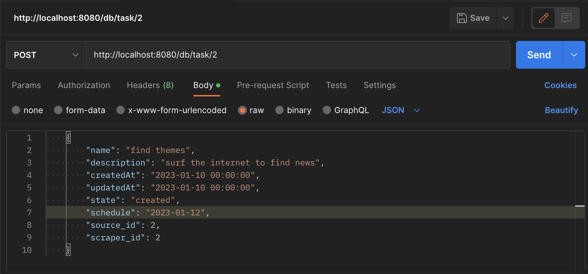

**Відповідь**

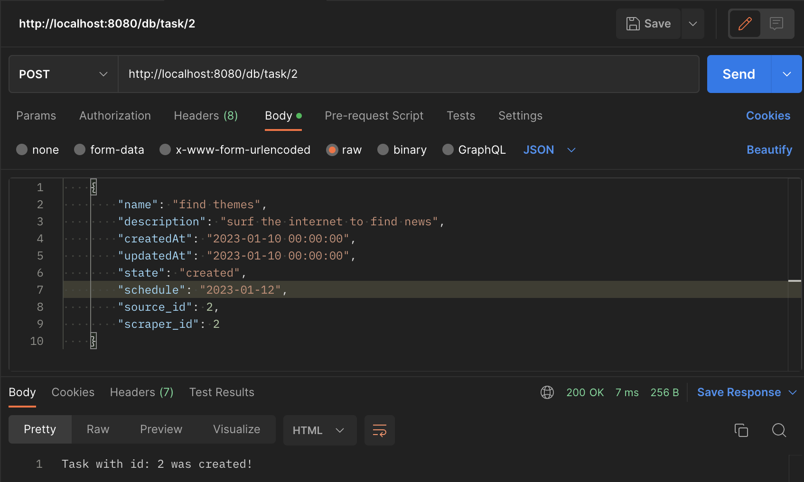

## Зчитування всіх сутностей Task (GET)

**Запит та результат**

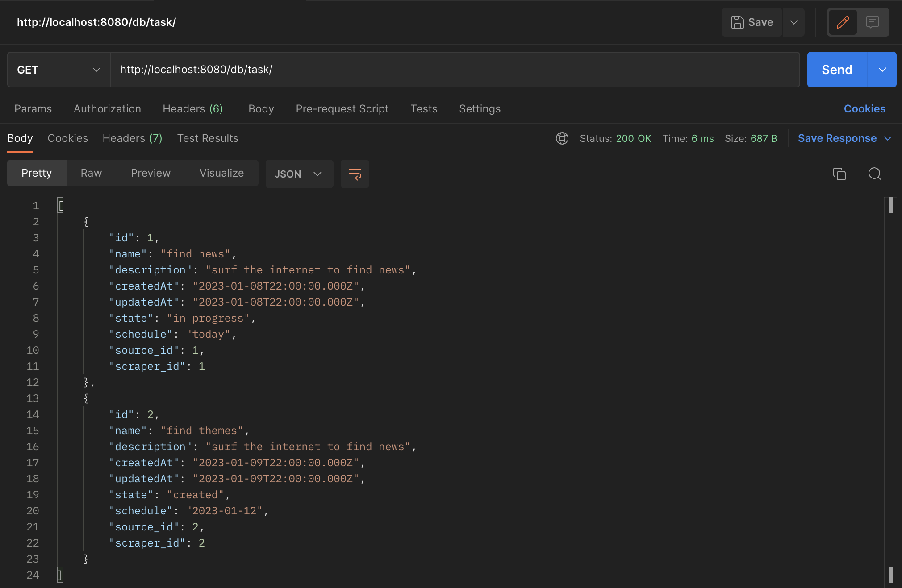

## Зчитування сутності Task по ID (GET)

**Запит та результат**

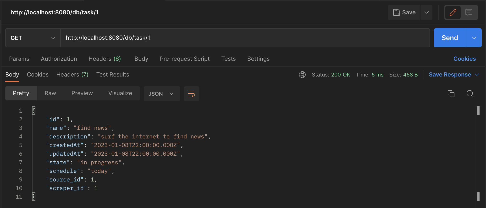

## Зчитування сутності Task по ID, що не існує (GET)

**Запит та результат**

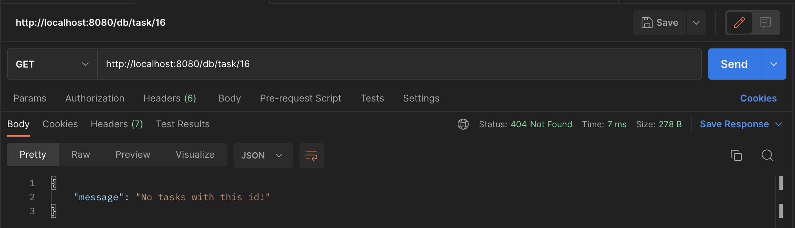

## Зчитування сутності Task по даті створення (GET)

**Запит та результат**

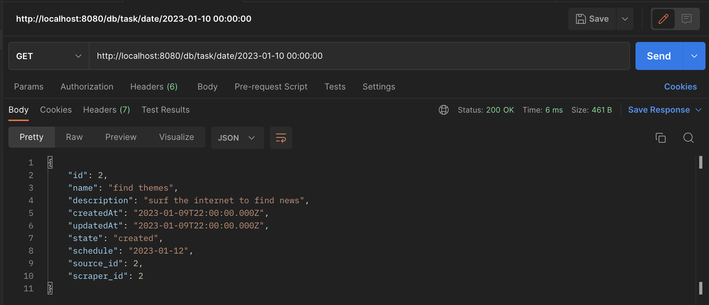

## Зчитування сутності Task по даті створення, що не існує (GET)

**Запит та результат**

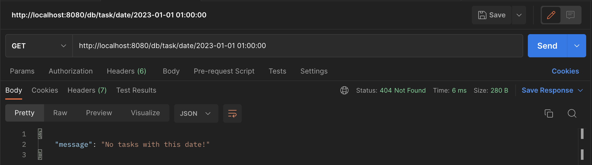

## Оновлення сутності Task (PUT)

**Запит**

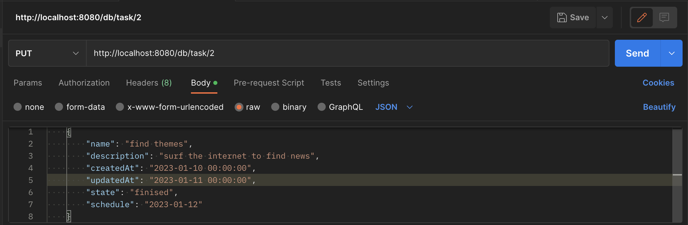

**Результат**

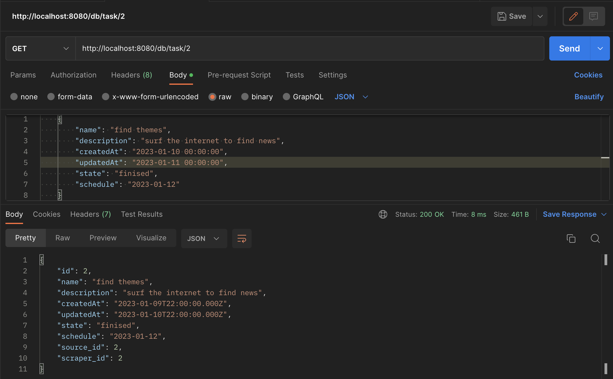

## Видалення сутності Task (DELETE)

**Запит**

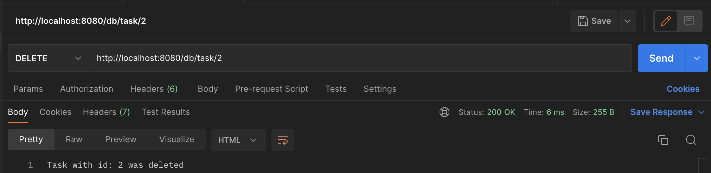

**Результат**

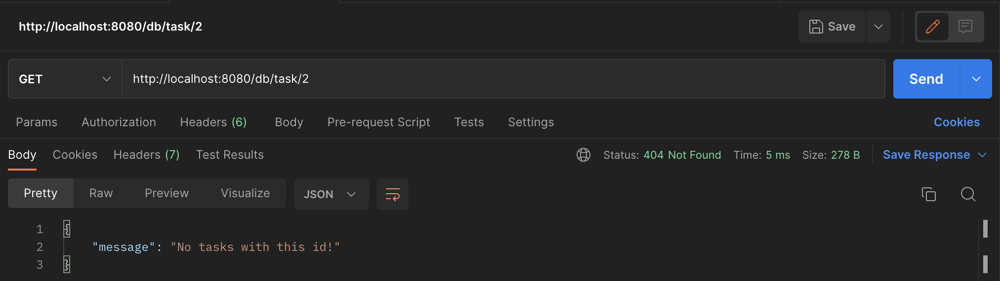

